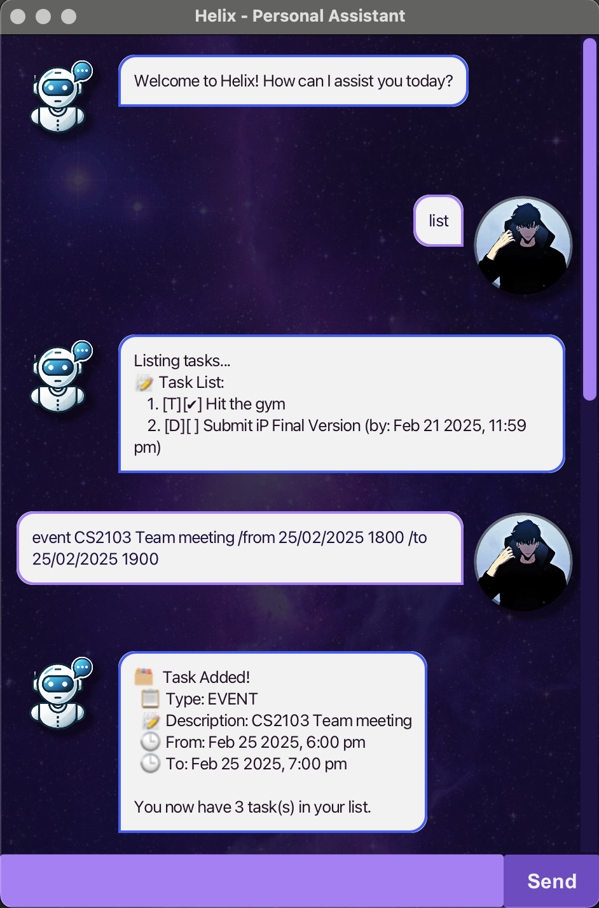

# Helix User Guide


\
*A Smart Task Manager with a Simple and Efficient Graphical User Interface (GUI).*

Helix is a **personal task management assistant** that allows users to create, manage, and organize their tasks efficiently using a **Graphical User Interface (GUI)**. It supports different types of tasks, such as to-dos, deadlines, and events, with file-based storage to ensure persistence across sessions.

---

## **Getting Started**

### **Installation**

1. Download the latest **Helix.jar** from the [Releases](https://github.com/twhjames/ip/releases) page.
2. Open a terminal and navigate to the folder containing `Helix.jar`.
3. Run the application using:
   ```bash
   java -jar Helix.jar
   ```

### **Basic Usage**
Helix operates entirely through its **GUI interface**, where users can interact with the assistant via a chat-style interface.

---

## **Adding To-Do Tasks**

### **Command:**

Adds a simple to-do task.

#### **Syntax:**

```bash
todo <task description>
```

#### **Example:**

```bash
todo Buy groceries
```

#### **Expected Output:**

```bash
Task Added!
  📋 Type: TODO
  📝 Description: Buy groceries
You now have X tasks in your list.
```

---

## **Adding Deadline Tasks**

### **Command:**

Adds a task with a deadline.

#### **Syntax:**

```bash
deadline <task description> /by <YYYY-MM-DD HHmm>
```

#### **Example:**

```bash
deadline Submit assignment /by 2024-12-31 1800
```

#### **Expected Output:**

```bash
Task Added!
  📋 Type: DEADLINE
  📝 Description: Submit assignment
  📅 Due: Dec 31 2024, 6:00 PM
You now have X tasks in your list.
```

---

## **Adding Event Tasks**

### **Command:**

Adds an event with a start and end time.

#### **Syntax:**

```bash
event <task description> /from <YYYY-MM-DD HHmm> /to <YYYY-MM-DD HHmm>
```

#### **Example:**

```bash
event Team meeting /from 2024-12-31 0900 /to 2024-12-31 1100
```

#### **Expected Output:**

```bash
Task Added!
  📋 Type: EVENT
  📝 Description: Team meeting
  🕒 From: Dec 31 2024, 9:00 AM
  🕒 To: Dec 31 2024, 11:00 AM
You now have X tasks in your list.
```

---

## **Listing Tasks**

### **Command:**

Displays all tasks in the list.

#### **Syntax:**

```bash
list
```

#### **Expected Output:**

```bash
📋 Task List:
  1. [T] [ ] Buy groceries
  2. [D] [✔] Submit assignment (by: Dec 31 2024, 6:00 PM)
  3. [E] [ ] Team meeting (from: Dec 31 2024, 9:00 AM to: Dec 31 2024, 11:00 AM)
```

---

## **Marking Tasks as Completed**

### **Command:**

Marks a task as done.

#### **Syntax:**

```bash
mark <task number>
```

#### **Example:**

```bash
mark 2
```

#### **Expected Output:**

```bash
✔ Task marked as complete!
  [D] [✔] Submit assignment (by: Dec 31 2024, 6:00 PM)
```

---

## **Unmarking Tasks**

### **Command:**

Marks a task as **not done**.

#### **Syntax:**

```bash
unmark <task number>
```

#### **Example:**

```bash
unmark 2
```

#### **Expected Output:**

```bash
❌ Task marked as incomplete!
  [D] [ ] Submit assignment (by: Dec 31 2024, 6:00 PM)
```

---

## **Deleting a Task**

### **Command:**

Removes a task from the list.

#### **Syntax:**

```bash
delete <task number>
```

#### **Example:**

```bash
delete 3
```

#### **Expected Output:**

```bash
🗑️ Task Removed!
  [E] [ ] Team meeting (from: Dec 31 2024, 9:00 AM to: Dec 31 2024, 11:00 AM)
You now have X tasks in your list.
```

---

## **Finding a Task**

### **Command:**

Searches for tasks containing a specific keyword.

#### **Syntax:**

```bash
find <keyword>
```

#### **Example:**

```bash
find groceries
```

#### **Expected Output:**

```bash
🔍 Tasks with matching keywords...
  1. [T] [ ] Buy groceries
```

---

## **Updating a Task**

### **Command:**

Updates a task’s description or details.

#### **Syntax:**

```bash
update <task number> <task type> <new details>
```

#### **Example:**

```bash
update 2 deadline Submit final report /by 2025-01-01 1200
```

#### **Expected Output:**

```bash
✔ Task updated successfully!
  [D] [ ] Submit final report (by: Jan 1 2025, 12:00 PM)
```

---

## **Exiting Helix**

### **Command:**

Closes the application.

#### **Syntax:**

```bash
bye
```

#### **Expected Output:**

```bash
Goodbye! See you again soon!
```

---

## **File Storage**

- Helix automatically **saves tasks** in `data/helix_tasklist.txt`.
- Data **persists across sessions**, so tasks are not lost when restarting.

---
